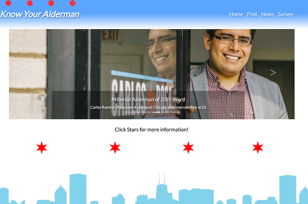
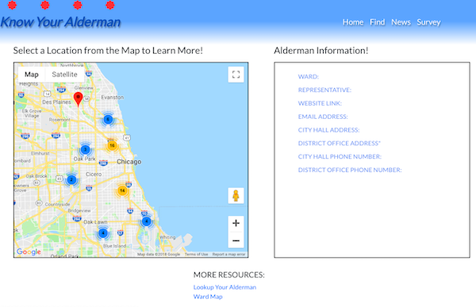
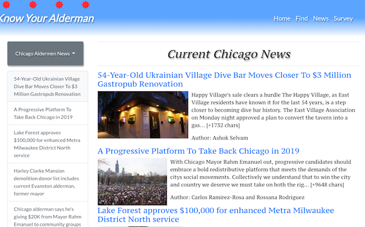
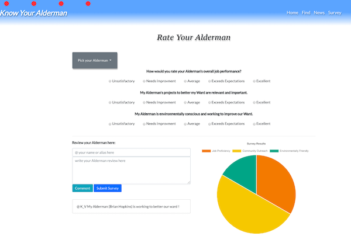

# Know Your Alderman Web App - Group Project

App: Know Your Alderman \
Created for: Northwestern Coding Bootcamp \
Developers: Kathy Barnak | Natalia Kukula | Kat Eng | Kayla Verheyen \
Deployment Date:  October 25, 2018 \
Published: GitHub <https://kaylaverheyen.github.io/know_your_alderman/> \
Frontend Technologies: HTML5, CSS3, Bootstrap, Javascript, jQuery, Animate.css \
Backend Technologies: AJAX, Google Map API, Data.Chicago API, News API, Firebase, Charts.js 

## Summary: 

### Screen 1: Education

* ...

* ...

* ...

 

### Screen 2: Map

* ...

* ...

* ...

 

### Screen 3: News

* Make an AJAX call to access the News API

* Dinamically append aricles to the screen

* Utilize an animation library to enhance user experience (Animate.CSS)

 

### Screen 4: Survey

* ...

* ...

* ...

 

## Notes:

We rocked this northwestern coding bootcamp project!  💪🏼